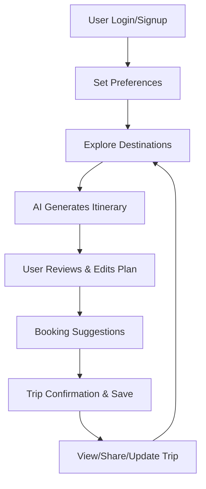

**TripCraft — AI Trip Planner**

TripCraft is a React + Vite single-page application for planning, analyzing and booking trips using AI-assisted recommendations. It provides multilingual support, theming, interactive maps, booking flows for flights/trains/buses/cabs/hotels, a persistent Redux store, and integrations for search, payments, recommendations and user management.

**Repository**: `TripCraft`

**Quick links**
- **Main entry**: `index.html`
- **Source**: `src/`
- **APIs**: `src/api/` (client wrappers for backend endpoints)
- **Docker**: `Dockerfile`

**Table of contents**
- Introduction
- Features (detailed)
- Project structure
- Installation & development (Windows `cmd.exe`)
- Environment variables
- Building & deployment (including Docker)
- Architecture & important modules
- Components and pages (summary)
- Testing & linting suggestions
- Troubleshooting
- Contribution & license

**Introduction**

TripCraft is an interactive travel planning web application built with React and Vite. It is designed to help users discover, analyze and book travel options using AI-powered recommendations and aggregated APIs. It focuses on clarity of trip itineraries, cost breakdowns, and map-driven experiences.

**Features (detailed)**

- **Multilingual UI (i18n):**
  - Languages provided: English, Hindi, Marathi.
  - Implemented via `src/i18n.js` and locale files under `public/locales/`.

- **Theming & Theme Provider:**
  - Light/dark theme support via `src/theme/theme.js`, `ThemeContext.jsx`, `ThemeProvider.jsx`.
  - Theme state is managed and exposed to app components.

- **Routing & Protected Routes:**
  - Route definitions in `src/routes/routes.js`.
  - `ProtectedRoute.jsx` component handles authentication gating for secure pages.

- **Authentication & User Management:**
  - API wrappers in `src/api/authApi.js` and `src/api/userApi.js`.
  - Authentication page/component at `src/pages/auth/Auth.jsx`.
  - Redux slice for auth in `src/redux/features/authSlice.js`.

- **Redux Store & State Management:**
  - Central store in `src/redux/store.js`.
  - Slices include `authSlice.js`, `langSlice.js`, `themeSlice.js`.

- **Trip Creation & New Trip Flow:**
  - Components: `src/components/newtrip/NewTripForm.jsx`, `TripForm.jsx`, `MapView.jsx`, `TripChat.jsx`.
  - Interactive form and map integration for defining trip waypoints and preferences.

- **Trip Details & Maps:**
  - Map-related components: `TripGoogleMapView.jsx`, `TripMapView.jsx`, `MapHandler.jsx`, `MapDirections.jsx`, `CustomMarker.jsx`.
  - Map style defined in `mapStyle.jsx`.
  - Place info windows and travel columns: `PlaceInfoWindow.jsx`, `TravelCol.jsx`.

- **Trip Itinerary & Display:**
  - `TripItineraryView.jsx`, `TripTravelOptions.jsx`, `TripInfoDisplay.jsx`, `TripItineraryPage.jsx`.
  - List and map-based itinerary presentation with travel option breakdowns.

- **Trip Booking Flow & Analysis:**
  - Booking view and analysis components in `src/components/TripBooking/`:
    - `AnalyzeTravel.jsx`, `FlightAnalysisSection.jsx`, `TrainAnalysisSection.jsx`, `BusAnalysisSection.jsx`, `CabAnalysisSection.jsx`.
    - `CostBreakdown.jsx`, `LegAnalysisDetails.jsx`, `SelectTravelOptions.jsx`, `FinalBookingStep.jsx`.
  - Hotel recommendations and preferences: `ViewHotelRecs.jsx`, `SetHotelPrefs.jsx`.

- **Search & Recommendations APIs:**
  - Search endpoints wrapped in `src/api/searchApi.js`.
  - Recommendations in `src/api/recommendationApi.js`.
  - Trip CRUD in `src/api/tripApi.js`, booking and payment via `bookingApi.js` and `paymentApi.js`.

- **Payments & Booking History:**
  - Payment integration code in `src/api/paymentApi.js`.
  - Pages: `PaymentHistory.jsx`, `AllBookings.jsx`, `ExploreBookings.jsx`.

- **Explore & Discovery:**
  - Explore pages and public landing: `src/pages/public/Landing.jsx`, `src/pages/App/Explore.jsx`.
  - Special booking pages for flights/trains/buses/hotels under `src/components/Explore/`.

- **Animations & Loading UX:**
  - Loading animations via `src/components/LoadingAnimation.jsx` and Lottie assets in `src/assets/` and `public/animations/`.

- **Static Assets & Branding:**
  - Assets: `src/assets/` contains JSON/lottie files used across the UI.

- **Client-side Utilities:**
  - Utility helpers in `src/utils/utils.js` and constants in `src/constants/contants.js`.

- **Responsive Layouts & Styles:**
  - Global styles: `src/App.css`, `src/index.css`.
  - Component/page-specific styles in `src/styles/` such as `TripMapView.css`, `MainLayout.css`, `Preferences.css`.

- **Accessibility & Error Handling:**
  - NotFound page at `src/pages/NotFound.jsx` and handling for missing routes.

**Project structure (top-level overview)**

- `index.html` — Vite entry HTML
- `src/` — Application source
  - `api/` — API clients: `authApi.js`, `bookingApi.js`, `enumsApi.js`, `paymentApi.js`, `recommendationApi.js`, `searchApi.js`, `tripApi.js`, `userApi.js`
  - `assets/` — Lottie and static animation JSONs
  - `components/` — Reusable UI and feature components (split by feature folders)
  - `constants/` — App constants (e.g., `contants.js`)
  - `pages/` — Page containers and route views
  - `redux/` — Store and feature slices
  - `routes/` — Route definitions
  - `styles/` — CSS files tuned for views
  - `theme/` — Theme code and providers
  - `utils/` — Small helpers
- `public/` — Static assets and locale JSONs
- `Dockerfile` — Containerization
- `package.json` — Project scripts & dependencies

**Installation & development (Windows `cmd.exe`)**

1) Install dependencies:

```cmd
cd %CD%\
cd "d:\My_Work\AiTripPlannar"
npm install
```

2) Run development server:

```cmd
npm run dev
```

3) Open the app in your browser at the address shown by Vite (typically `http://localhost:5173`).

4) Build for production:

```cmd
npm run build
```

5) Preview production build locally:

```cmd
npm run preview
```

Notes:
- If your `package.json` uses different script names, adapt the commands accordingly.

**Environment variables**

- Typical Vite env variables use the `VITE_` prefix. Example variables your environment may require:
  - `VITE_API_BASE_URL` — backend API base URL
  - `VITE_GOOGLE_MAPS_KEY` — Google Maps / map provider API key (if used by map components)
  - `VITE_SENTRY_DSN` — optional monitoring

Create a `.env` file at project root (do not commit secrets):

```text
VITE_API_BASE_URL=https://api.example.com
VITE_GOOGLE_MAPS_KEY=your_key_here
```

**Running with Docker**

Build the image and run a container (Windows `cmd.exe`):

```cmd
docker build -t tripcraft:latest .
docker run -p 5173:5173 --env VITE_API_BASE_URL="https://api.example.com" tripcraft:latest
```

Adjust the port and env variables as needed. If the `Dockerfile` uses different build steps, review it before running.

**Architecture & important modules**

- `src/api/*` — Thin client wrappers for backend endpoints. Centralize network calls, authentication headers and error handling here.
- `src/redux/store.js` — Central store creation. Add middleware (logger, thunk) here.
- `src/theme/*` — Theme provider and context for global theme switching.
- `src/i18n.js` — Internationalization setup and language loader.
- Map files — `TripGoogleMapView.jsx`, `TripMapView.jsx`, `MapHandler.jsx` implement map rendering, markers and directions.

**Components & pages (summary with location)**

- `src/components/LanguageSelector.jsx` — language switching UI
- `src/components/LoadingAnimation.jsx` — global loading animations
- `src/components/ProtectedRoute.jsx` — route guard component
- `src/components/newtrip/*` — new trip creation components
- `src/components/TripBooking/*` — booking and analysis UI components
- `src/components/TripDetails/*` — trip detail, itinerary, maps and related UI
- `src/pages/App/*` — main app pages such as `Dashboard.jsx`, `Trips.jsx`, `TripsDetails.jsx`, `Preferences.jsx`.

**APIs (wrappers present)**

- `src/api/authApi.js` — authentication endpoints
- `src/api/userApi.js` — user profile and preferences
- `src/api/tripApi.js` — create/read/update/delete trips
- `src/api/searchApi.js` — search transport/hotel options
- `src/api/recommendationApi.js` — AI/ML recommendation calls
- `src/api/bookingApi.js` — booking submission and status
- `src/api/paymentApi.js` — payment processing endpoints

When connecting the frontend to a real backend, ensure backend endpoints match the wrappers or update them accordingly.

**Testing & quality**

- Add unit tests with your preferred test runner (Jest + React Testing Library recommended).
- Example test targets:
  - `src/components/*` unit snapshots and behavior tests
  - `src/utils/*` helper logic
  - `src/redux/*` reducers and selectors
- Lint and format: ESLint + Prettier are recommended (project contains `eslint.config.js`).

**Troubleshooting**

- If the dev server does not start, check Node version (Node 16+ recommended). Run `node -v`.
- If maps fail to render, confirm `VITE_GOOGLE_MAPS_KEY` or the map provider key is set and allowed for your domain.
- If API calls fail, verify `VITE_API_BASE_URL` and CORS settings on your backend.

**Contribution guide**

- Fork the repository and open a pull request against `v3` branch.
- Keep changes small and focused. Add unit tests for new logic.
- Follow existing code style and naming conventions.

**Recommended next steps for maintainers**

- Add `README` sections for running tests and CI coverage once tests are available.
- Add a `DEVELOPMENT.md` for contributor conventions and branch rules.
- Add basic E2E tests (Cypress/Playwright) covering the booking flow.

**License**

- Add your preferred license file (`LICENSE`) in project root. If none present, mention licensing expectations in PRs.

---

If you want, I can:
- add a short `CONTRIBUTING.md` and `DEVELOPMENT.md` (recommended), or
- open a small PR to wire up example env variables and a checklist for deploys.
# TripCraft AI


## 🌍 Brief Overview

**TripCraft AI** is a next-generation, AI-powered travel planning platform designed for modern travelers. It leverages artificial intelligence to craft personalized itineraries, recommend destinations, and streamline the entire trip planning process—from inspiration to booking. With a focus on user preferences, real-time data, and a delightful user experience, TripCraft AI aims to make travel planning effortless, flexible, and fun.

---

## 🚀 How is TripCraft AI Different?

- **AI-Driven Personalization:** Unlike traditional travel sites, TripCraft AI uses advanced algorithms to understand your travel style, preferences, and constraints, generating unique, dynamic itineraries tailored just for you.
- **End-to-End Planning:** From discovering destinations to booking travel and accommodations, everything happens in one place—no more juggling multiple tabs or apps.
- **Modern, Intuitive UI:** Built with Gen-Z and millennial travelers in mind, the interface is clean, interactive, and mobile-friendly.
- **Real-Time Adaptability:** Plans can be updated on the fly, with instant AI suggestions for alternatives and adjustments.
- **Cultural & Local Insights:** Beyond tourist spots, the platform recommends hidden gems, local experiences, and authentic food/culture tips.

---

## 🧩 How Does It Solve the Problem?

Traditional travel planning is time-consuming, fragmented, and often overwhelming. TripCraft AI solves this by:
- **Reducing Decision Fatigue:** AI narrows down choices based on your vibe, budget, and interests.
- **Saving Time:** Automated itinerary generation and booking suggestions mean less manual research.
- **Increasing Flexibility:** Change your plans anytime and get instant, updated recommendations.
- **Enhancing Experiences:** Discover offbeat places and local experiences you might otherwise miss.

---

## ✨ Unique Selling Propositions (USP)

- **AI-Powered Itinerary Generation:** Get a full trip plan in seconds, not hours.
- **Preference Memory:** The platform remembers your travel style for future trips.
- **Integrated Booking Suggestions:** Live travel and accommodation options, tailored to your route.
- **Multi-Language Support:** Plan in your preferred language.
- **Interactive Maps & Visuals:** Visualize your journey and explore places with rich media.

---

## 📝 Feature List

- **Smart Trip Creation:** Enter your preferences, and let AI do the rest.
- **Explore Destinations:** Filter by activity, city, best time to visit, and more.
- **Personalized Recommendations:** Based on your travel history and preferences.
- **Itinerary Visualization:** Timeline and map views of your trip.
- **Booking Integration:** Suggestions for trains, flights, and hotels.
- **Travel Preferences:** Save your default travel style, group size, and budget.
- **Multi-Language UI:** English, Hindi, and more.
- **Modern Authentication:** Google OAuth login.
- **Responsive Design:** Works seamlessly on desktop and mobile.
- **Loading Animations & Smooth Transitions:** Delightful user experience.

---

## 🛠️ Technologies Used

- **Frontend:** React, Ant Design, Framer Motion, Lottie
- **State Management:** Redux Toolkit
- **API Layer:** RTK Query
- **Maps:** Google Maps API, React-Leaflet
- **Internationalization:** i18next
- **Backend (API):** FastAPI (Python)
- **Authentication:** Google OAuth
- **Build Tools:** Vite
- **Styling:** CSS Modules, Custom Themes

---

## 🔄 Process Flow Diagram



---

## 🏗️ Project Structure

- `src/` - Main React source code (components, pages, API, redux, theme, utils)
- `public/` - Static assets, localization files, animations
- `auth.py` - FastAPI backend authentication logic
- `test.py` - Data processing scripts
- `tripdetail.json` - Sample trip data
- `package.json` - Project dependencies and scripts

---

## ⚡ Getting Started

1. **Clone the repo:**
	```sh
	git clone https://github.com/sam-79/aitripplannar.git
	cd aitripplannar
	```
2. **Install dependencies:**
	```sh
	npm install
	```
3. **Set up environment variables:**  
	Copy `.env.local` and fill in your API keys.
4. **Run the app:**
	```sh
	npm run dev
	```
5. **(Optional) Start backend:**  
	See [`auth.py`](auth.py) for FastAPI backend setup.

---

## 📈 Future Enhancements

- Social trip sharing and collaboration
- Deeper booking integrations (hotels, activities)
- AI-powered budget optimization
- Offline mode and PWA support

🔮 Future Scope
Collaborative Planning: Allow multiple users to edit a trip in real-time.

Budget Tracking: Integrate a tool to track expenses against the planned budget.

Booking Integration: Connect with flight and hotel booking APIs.

Offline Access: Implement PWA (Progressive Web App) features for offline map and itinerary access.

Real-time Travel Alerts: Notifications for flight delays, weather changes, etc.
---

## Author

[Sameer Borkar](https://github.com/sam-79)

[Shantanu Nimkar](https://github.com/shantanu1905)

## 🙌 Contributing

Pull requests are welcome! For major changes, please open an issue first to discuss what you would like to change.

---

## 📄 License

This project is licensed under the MIT License.

---

**Craft your next adventure with TripCraft AI!**
