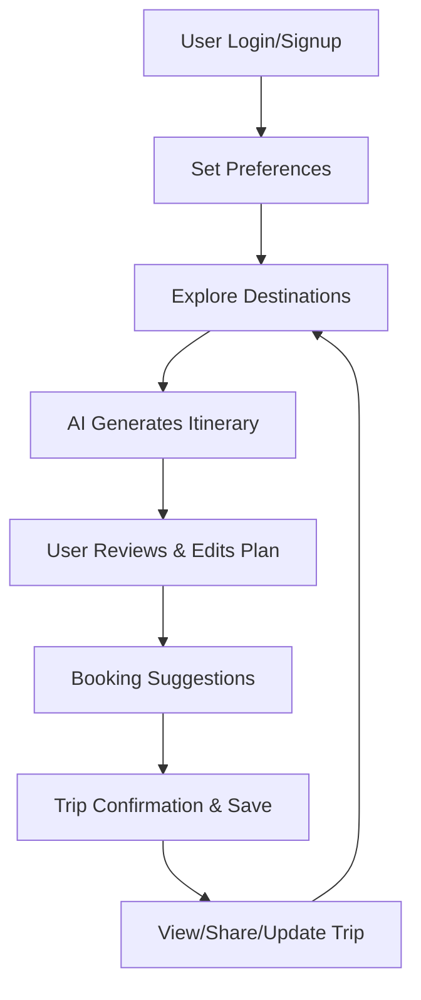

# TripCraft AI


## 🌍 Brief Overview

**TripCraft AI** is a next-generation, AI-powered travel planning platform designed for modern travelers. It leverages artificial intelligence to craft personalized itineraries, recommend destinations, and streamline the entire trip planning process—from inspiration to booking. With a focus on user preferences, real-time data, and a delightful user experience, TripCraft AI aims to make travel planning effortless, flexible, and fun.

---

## 🚀 How is TripCraft AI Different?

- **AI-Driven Personalization:** Unlike traditional travel sites, TripCraft AI uses advanced algorithms to understand your travel style, preferences, and constraints, generating unique, dynamic itineraries tailored just for you.
- **End-to-End Planning:** From discovering destinations to booking travel and accommodations, everything happens in one place—no more juggling multiple tabs or apps.
- **Modern, Intuitive UI:** Built with Gen-Z and millennial travelers in mind, the interface is clean, interactive, and mobile-friendly.
- **Real-Time Adaptability:** Plans can be updated on the fly, with instant AI suggestions for alternatives and adjustments.
- **Cultural & Local Insights:** Beyond tourist spots, the platform recommends hidden gems, local experiences, and authentic food/culture tips.

---

## 🧩 How Does It Solve the Problem?

Traditional travel planning is time-consuming, fragmented, and often overwhelming. TripCraft AI solves this by:
- **Reducing Decision Fatigue:** AI narrows down choices based on your vibe, budget, and interests.
- **Saving Time:** Automated itinerary generation and booking suggestions mean less manual research.
- **Increasing Flexibility:** Change your plans anytime and get instant, updated recommendations.
- **Enhancing Experiences:** Discover offbeat places and local experiences you might otherwise miss.

---

## ✨ Unique Selling Propositions (USP)

- **AI-Powered Itinerary Generation:** Get a full trip plan in seconds, not hours.
- **Preference Memory:** The platform remembers your travel style for future trips.
- **Integrated Booking Suggestions:** Live travel and accommodation options, tailored to your route.
- **Multi-Language Support:** Plan in your preferred language.
- **Interactive Maps & Visuals:** Visualize your journey and explore places with rich media.

---

## 📝 Feature List

- **Smart Trip Creation:** Enter your preferences, and let AI do the rest.
- **Explore Destinations:** Filter by activity, city, best time to visit, and more.
- **Personalized Recommendations:** Based on your travel history and preferences.
- **Itinerary Visualization:** Timeline and map views of your trip.
- **Booking Integration:** Suggestions for trains, flights, and hotels.
- **Travel Preferences:** Save your default travel style, group size, and budget.
- **Multi-Language UI:** English, Hindi, and more.
- **Modern Authentication:** Google OAuth login.
- **Responsive Design:** Works seamlessly on desktop and mobile.
- **Loading Animations & Smooth Transitions:** Delightful user experience.

---

## 🛠️ Technologies Used

- **Frontend:** React, Ant Design, Framer Motion, Lottie
- **State Management:** Redux Toolkit
- **API Layer:** RTK Query
- **Maps:** Google Maps API, React-Leaflet
- **Internationalization:** i18next
- **Backend (API):** FastAPI (Python)
- **Authentication:** Google OAuth
- **Build Tools:** Vite
- **Styling:** CSS Modules, Custom Themes

---

## 🔄 Process Flow Diagram



---

## 🏗️ Project Structure

- `src/` - Main React source code (components, pages, API, redux, theme, utils)
- `public/` - Static assets, localization files, animations
- `auth.py` - FastAPI backend authentication logic
- `test.py` - Data processing scripts
- `tripdetail.json` - Sample trip data
- `package.json` - Project dependencies and scripts

---

## ⚡ Getting Started

1. **Clone the repo:**
	```sh
	git clone https://github.com/sam-79/aitripplannar.git
	cd aitripplannar
	```
2. **Install dependencies:**
	```sh
	npm install
	```
3. **Set up environment variables:**  
	Copy `.env.local` and fill in your API keys.
4. **Run the app:**
	```sh
	npm run dev
	```
5. **(Optional) Start backend:**  
	See [`auth.py`](auth.py) for FastAPI backend setup.

---

## 📈 Future Enhancements

- Social trip sharing and collaboration
- Deeper booking integrations (hotels, activities)
- AI-powered budget optimization
- Offline mode and PWA support

🔮 Future Scope
Collaborative Planning: Allow multiple users to edit a trip in real-time.

Budget Tracking: Integrate a tool to track expenses against the planned budget.

Booking Integration: Connect with flight and hotel booking APIs.

Offline Access: Implement PWA (Progressive Web App) features for offline map and itinerary access.

Real-time Travel Alerts: Notifications for flight delays, weather changes, etc.
---

## Author

[Sameer Borkar](https://github.com/sam-79)

[Shantanu Nimkar](https://github.com/shantanu1905)

## 🙌 Contributing

Pull requests are welcome! For major changes, please open an issue first to discuss what you would like to change.

---

## 📄 License

This project is licensed under the MIT License.

---

**Craft your next adventure with TripCraft AI!**
